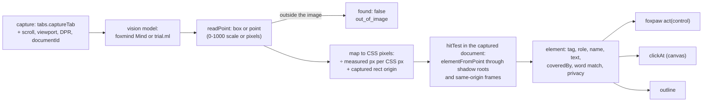
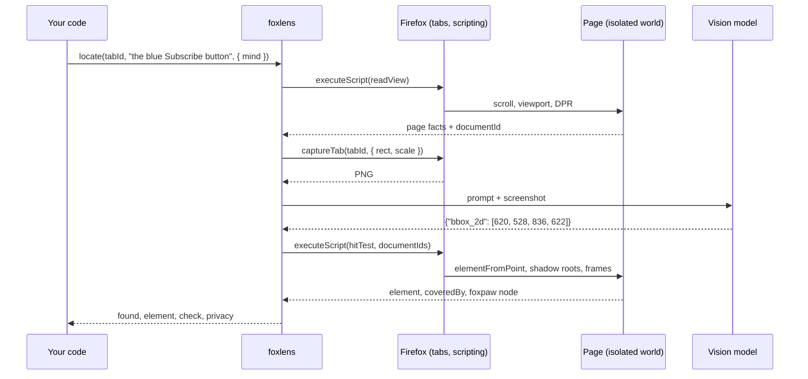
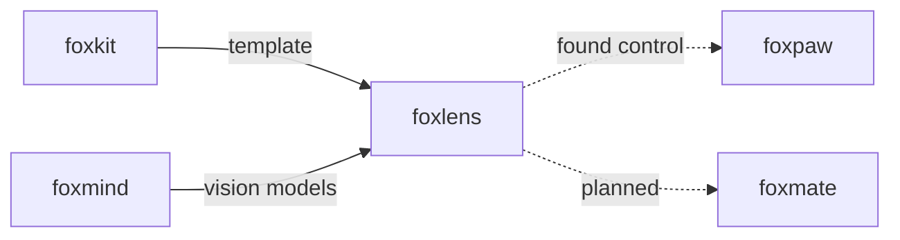

# foxlens

See a page as an image when the DOM is not enough: screenshot plus a vision model.

foxlens is the fallback "eyes" of a browser agent in Firefox. Some pages do
not tell the DOM what they show: a button drawn on a `<canvas>`, a button that
is only an image, a widget in a closed shadow root. foxlens takes a screenshot
of the tab, asks a vision model where the element is, and maps the answer back
to a real element in the page. Each result says where the screenshot went, over every model call it made.

## Install

```bash
npm i foxlens
```

foxlens uses [foxmind](https://github.com/pooriaarab/foxmind) for vision chat
models. Install it too: `npm i foxmind`.

## Example

This code runs in a Firefox extension page or background script that you
bundle, for example with esbuild. The extension needs the `scripting`
permission and host access to the page (`"host_permissions": ["<all_urls>"]`).
It uses a vision model in Ollama on the same machine:

```bash
ollama pull qwen3-vl:2b-instruct
OLLAMA_ORIGINS="moz-extension://*" ollama serve
```

Ollama refuses extension origins without `OLLAMA_ORIGINS`.

```js
import { createMind, ollama } from "foxmind";
import { locate, outline } from "foxlens";

// only: ["browser", "local"] means no cloud provider can get the screenshot.
const mind = createMind({ only: ["browser", "local"], providers: [ollama({ model: "qwen3-vl:2b-instruct" })] });
const [tab] = await browser.tabs.query({ active: true, currentWindow: true });

const hit = await locate(tab.id, "the blue Subscribe button", { mind });
if (hit.found) {
  await outline(tab.id, hit, { box: hit.element.tag === "canvas" });
  console.log(hit.element.tag, hit.docPoint, hit.privacy.tier, hit.privacy.leftDevice);
} else {
  console.log("not found:", hit.reason);
}
```

On the canvas fixture page (`e2e/site/canvas.html`), our E2E run with
`qwen3-vl:2b-instruct` gave this result. The point is inside the drawn
button:

```text
canvas { x: 728, y: 452.5 } local false
```

To try it without writing code, build the demo extension and load it:

```bash
pnpm install
pnpm build:ext
```

In Firefox, open `about:debugging#/runtime/this-firefox`, click **Load
Temporary Add-on**, and choose `dist-ext/manifest.json`. Click the toolbar
button. Type a description in **Find** and click **Find**. The panel outlines
what the model found and shows the element's tag, role, name and text.
**Describe this tab** writes a description of the page. For a server that
is not on this device, check **Send screenshots to this server**. The panel
then asks Firefox for the `websiteContent` data permission, and sends nothing
when you say no. Keep the popup open
while the model works. The panel also opens in the sidebar.

## Use cases

| Who | What they build | How foxlens helps |
|---|---|---|
| Agent builders | An agent that works in canvas apps: whiteboards, maps, games, design tools | `locate` finds a drawn control that has no DOM node, and `clickAt` clicks that point. |
| Accessibility tool makers | A tool that tells a screen reader user what an image-only page shows | `describe` writes a description of the tab with a local model or Firefox's own image-to-text model, so the page does not leave the computer. |
| QA testers | Visual checks in real Firefox: "is the Subscribe button on screen and not covered?" | `locate` returns the element under the point, a `coveredBy` element when something lies over it, and a word-match score. |
| Content editors and CMS plugin authors | An alt-text helper that suggests text for images that have none | `describe` on a captured region (`capture(tabId, { rect })`) gives a first draft that a person checks. |
| foxpaw users | A fallback for controls foxpaw cannot name, such as an icon button with no label | Pass a foxpaw snapshot to `locate`. You get foxpaw's own `control` back, so foxpaw's `act` keeps its stale check. |
| Benchmark and research teams | A test of how well vision models find UI elements | The E2E fixtures in `e2e/site` and the fake colour model in `e2e/harness` give a known right answer at DPR 1 and 2, with zoom and scroll. |

## How it works



1. `capture` reads `scrollX`, `scrollY`, the viewport size and
   `devicePixelRatio` in the page, then calls `tabs.captureTab` for that rect.
   It measures image pixels per CSS pixel from the PNG header. It does not
   trust `devicePixelRatio` or the `scale` option, because Firefox multiplies
   the scale by the page zoom. The longer image side is at most 2048 pixels.
2. `locate` asks the model for a box. The prompt names the image size and the
   scale (0 to 1000 by default, as Qwen-VL models answer). `readPoint` reads
   the reply in the shapes models use, and refuses values outside the image.
   It does not clamp them.
3. The point becomes document CSS pixels. When the page scrolled after the
   capture, foxlens first looks at the viewport point the model saw. A fixed
   element there is still there, so foxlens keeps that point
   (`anchor: "viewport"`). Otherwise it subtracts the current scroll from the
   document point. When a fixed or sticky layer now lies on that point, or
   the element the model saw was sticky, the result is `stale`. A change of
   viewport size, zoom or DPR also gives `stale`.
4. A bundled page function hit-tests the point. It goes into closed shadow
   roots with Firefox's `openOrClosedShadowRoot` and into same-origin frames.
   It walks up to the nearest control and names any element that covers it.
   The call targets the captured `documentId`, so Firefox refuses it after a
   navigation or reload.

In grid mode (`grid: 8`), foxlens draws numbered cells over the page and asks
for a cell number. Then it draws 6 x 6 cells over the area around that cell
and asks again. The point comes from the cell geometry in CSS pixels.



foxlens sends no code strings to the page. Every page function is bundled
with the extension and gets its data as JSON arguments.

### Privacy

The screenshot goes only to the model you pass. Every result has
`privacy: { tier, provider, model, leftDevice }`. `leftDevice` is true only
for the `cloud` tier. When a foxmind `Mind` has a chat provider on the cloud
tier, `describe` and `locate` throw `cloud_not_allowed` before any call. Pass
`allowCloud: true` to allow it. For a local-only Mind, use foxmind's
`only: ["browser", "local"]`.

Ollama models whose name ends in `-cloud` (for example
`qwen3-vl:235b-cloud`) run on ollama.com, even though the server is on
localhost and foxmind calls it `local`. foxlens treats them as the cloud
tier: it refuses them without `allowCloud`, and reports `leftDevice: true`.

`allowCloud` guards a foxmind Mind only. When you pass your own `eyes`,
foxlens cannot check where they send the image before the call. It reports
the tier your eyes give.

## API

foxlens is a library. It has no CLI and no MCP server.

| Export | What it does |
|---|---|
| `capture(tabId, { rect?, scale?, maxSide? })` | Screenshots the viewport, or a rect in document CSS pixels. Returns `dataUrl`, `width`, `height`, `rect`, `pxPerCss` (measured), `downscaled`, `dpr`, `zoom`, `scroll`, `viewport`, `url`, `documentId`, `mutations` and `at`. |
| `describe(image, { mind? \| eyes?, allowCloud?, prompt?, signal? })` | Describes a `Capture` or a PNG data URL. Returns `{ text, privacy, ms }`. |
| `locate(tabId, description, { mind? \| eyes?, allowCloud?, grid?, coordinates?, capture?, snapshot?, signal? })` | Finds an element. A found result has `point` (viewport), `anchor` (`viewport` for a fixed element, else `document`), `docPoint`, `imageBox`, `docBox`, `element`, `check`, `changed`, `privacy`, `reply`, and `control` when you pass a foxpaw `snapshot`. A result with `found: false` has `reason`: `not_found`, `out_of_image`, `bad_reply`, `offscreen`, `stale` or `nothing_there`. |
| `clickAt(tabId, found)` | Clicks the found point with in-page pointer and mouse events. Returns `{ ok }` or `{ ok: false, reason }` with `stale`, `covered` or `offscreen`. Use it for a canvas; use foxpaw's `act` for real controls. |
| `outline(tabId, found, { box?, colour?, ms? })` | Draws a box around the element, or around the model's box with `box: true`. |
| `mindEyes(mind, { allowCloud?, maxTokens? })` | A vision chat model through a foxmind `Mind`. The screenshot goes out as an OpenAI `image_url` part. |
| `trialMLEyes({ model?, device? })` | Firefox's image-to-text model (`Mozilla/distilvit` by default). It captions only, so `locate` refuses it. Needs the optional `trialML` permission. |
| `readPoint(text, { width, height, coordinates })`, `readCell(text, cells)`, `toDocument(capture, point)` | The reply parsers and the pixel mapping, for callers that run their own model call. |
| `matchWords(description, element)` | The word-match score in `check`. |
| `FoxlensError` | Every failure. `code` is `permission`, `no_tab`, `bad_image`, `cloud_not_allowed`, `unsupported` or `stale`. Model call errors stay foxmind's `FoxmindError`. |

An `Eyes` object is any vision model:

```ts
interface Eyes {
  readonly name: string;
  readonly canPoint: boolean;
  ask(image: string, prompt: string, options: { json?: boolean; signal?: AbortSignal }): Promise<{ text: string; provider: string; tier: "browser" | "local" | "cloud"; model: string; ms: number }>;
}
```

### With foxpaw

Take a foxpaw snapshot first, then pass it to `locate`. When foxpaw read the
found element, `control` is foxpaw's own control for it:

```js
import { act, snapshot } from "foxpaw";
import { locate } from "foxlens";

const page = await snapshot(tabId);
const hit = await locate(tabId, "the icon button that starts the export", { mind, snapshot: page });
if (hit.found && hit.control) await act(tabId, hit.control, { op: "click" }, page);
```

## Tests

`pnpm ci:local` runs lint, typecheck, 30 isolated tests and the build.
`docs/failure-modes.md` lists each failure mode (C1-C8, M1-M9, L1-L14, A1-A5,
P1-P5, D1-D4) and its test. The tests went in before the code.

`pnpm e2e` builds the demo extension plus a harness page and runs them in
Firefox at DPR 1 and DPR 2, with a 1000 x 700 viewport. A fake vision model
finds a colour in the real screenshot, so a wrong DPR, zoom or scroll mapping
misses the button. When Ollama has a vision model, the run also uses it
through foxmind. Results of our run on 2026-10-09 (Firefox 157.0.1, Apple M3
Pro, headless; all 66 checks passed):

| Check | Result |
|---|---|
| Fake model: canvas button at DPR 1 and 2, 150 % zoom, scrolled, scroll after capture | inside the drawn button each time |
| Fake model: image-only button, covered button, same-origin frame, closed shadow root | the right element each time |
| `qwen3-vl:2b-instruct` (Ollama): locate the canvas Subscribe button | inside the drawn button, 16 s |
| `qwen3-vl:2b-instruct`: locate the image-only Join button | the right `<button>`, 21 s |
| `qwen3-vl:2b-instruct`: describe the canvas page | named both buttons, missed the "Daily news" heading, 43 s |
| `qwen3-vl:2b-instruct` in grid mode | answered `{"found": false}` |
| trial.ml `Mozilla/distilvit` caption of the canvas page | "Slices of a blue sign with an arrow." (wrong), 27 s with download |

In earlier runs, the thinking model `qwen3-vl:2b` took 1 to 4 minutes per
answer. One description came back empty after it used its whole token budget,
and one call stopped at the 5-minute timeout. Use an instruct model.

## Firefox APIs used

| API | MDN | Why |
|---|---|---|
| `tabs.captureTab(tabId, { rect, scale })` | [MDN](https://developer.mozilla.org/en-US/docs/Mozilla/Add-ons/WebExtensions/API/tabs/captureTab) | Screenshots any tab, or a region of it (Firefox only). Needs host permission. |
| `tabs.getZoom` | [MDN](https://developer.mozilla.org/en-US/docs/Mozilla/Add-ons/WebExtensions/API/tabs/getZoom) | Divides the page zoom out of the capture scale. |
| `tabs.query` | [MDN](https://developer.mozilla.org/en-US/docs/Mozilla/Add-ons/WebExtensions/API/tabs/query) | The demo finds the page tab. |
| `scripting.executeScript` (`func`, `args`, `world: "ISOLATED"`) | [MDN](https://developer.mozilla.org/en-US/docs/Mozilla/Add-ons/WebExtensions/API/scripting/executeScript) | Runs the bundled page functions: read the view, hit test, click, outline, grid. |
| `scripting.InjectionTarget.documentIds` | [MDN](https://developer.mozilla.org/en-US/docs/Mozilla/Add-ons/WebExtensions/API/scripting/InjectionTarget) | Pins the hit test to the captured document (Firefox 153). |
| `Element.openOrClosedShadowRoot` | [MDN](https://developer.mozilla.org/en-US/docs/Web/API/Element/openOrClosedShadowRoot) | Goes into closed shadow roots from an extension (Firefox only). |
| `Document.elementFromPoint`, `elementsFromPoint`, `ShadowRoot.elementFromPoint` | [MDN](https://developer.mozilla.org/en-US/docs/Web/API/Document/elementFromPoint) | Finds the element under the point, and what is below a covering element. |
| `HTMLIFrameElement.contentDocument` | [MDN](https://developer.mozilla.org/en-US/docs/Web/API/HTMLIFrameElement/contentDocument) | Goes into same-origin frames. It is null for cross-origin frames. |
| `MutationObserver` | [MDN](https://developer.mozilla.org/en-US/docs/Web/API/MutationObserver) | Counts DOM changes between capture and locate. |
| `WeakRef` | [MDN](https://developer.mozilla.org/en-US/docs/Web/JavaScript/Reference/Global_Objects/WeakRef) | Remembers the found element for `clickAt` and `outline` without keeping it alive. |
| `PointerEvent`, `MouseEvent` | [MDN](https://developer.mozilla.org/en-US/docs/Web/API/EventTarget/dispatchEvent) | `clickAt` clicks with in-page events at the point. |
| `requestAnimationFrame` | [MDN](https://developer.mozilla.org/en-US/docs/Web/API/Window/requestAnimationFrame) | Waits for the grid to paint before the capture. |
| `browser.trial.ml` (`createEngine`, `runEngine`) | No MDN page: [Firefox source docs](https://firefox-source-docs.mozilla.org/toolkit/components/ml/extensions.html) | `trialMLEyes` runs the `image-to-text` task on the device. |
| `permissions.request` / `permissions.contains` | [MDN](https://developer.mozilla.org/en-US/docs/Mozilla/Add-ons/WebExtensions/API/permissions/request) | Asks for and checks the optional `trialML` permission. |
| `host_permissions` | [MDN](https://developer.mozilla.org/en-US/docs/Mozilla/Add-ons/WebExtensions/manifest.json/host_permissions) | `captureTab` and `executeScript` need host access to the page. |
| `storage.local` | [MDN](https://developer.mozilla.org/en-US/docs/Mozilla/Add-ons/WebExtensions/API/storage/local) | The demo keeps its settings and the last result. |
| `action` popup and `sidebar_action` | [MDN](https://developer.mozilla.org/en-US/docs/Mozilla/Add-ons/WebExtensions/manifest.json/sidebar_action) | The demo panel opens in both places. |
| `browser_specific_settings.gecko.data_collection_permissions` | [MDN](https://developer.mozilla.org/en-US/docs/Mozilla/Add-ons/WebExtensions/manifest.json/browser_specific_settings) | The demo declares `websiteContent` as optional: a screenshot leaves the device only when you choose a remote server. |
| `createImageBitmap`, `OffscreenCanvas` | [MDN](https://developer.mozilla.org/en-US/docs/Web/API/OffscreenCanvas) | The E2E fake model reads pixels of the real screenshot. Not used by the library. |

## Limits

- We tested cloud models only against fake servers. We used no real API key.
- foxmind's `anthropic()` provider does not turn OpenAI image parts into
  Anthropic image blocks, so it cannot take the screenshot. For a cloud model, use `openaiCompatible()` with a server that
  takes OpenAI image parts (for example OpenAI or OpenRouter).
- Firefox's `Mozilla/distilvit` captions were wrong for our test pages. Use it
  only for a rough caption.
- Grid mode worked with the fake model only. `qwen3-vl:2b-instruct` said it
  found nothing in grid mode.
- foxlens cannot tell that a model has no vision. A text-only model gives
  wrong answers; `check.match` and `nothing_there` can catch some of them.
- A canvas that redraws after the capture (a game, a chart) is not detected.
  The DOM does not change, so `changed.mutations` stays 0.
- `changed.mutations` counts any DOM change. foxlens does not compare pixels.
- Cross-origin frames are not searched. `locate` returns the `<iframe>`.
- The foxpaw `control` comes back only for elements in the top frame. foxlens
  reads foxpaw's page cache, so both must run in the same extension.
- `clickAt` events have `isTrusted: false`. A page that checks for trusted
  input can ignore them.
- A capture's longer side is at most 2048 image pixels. On a very long page,
  small text becomes too small to read.
- The demo runs the model in its panel. Keep the popup open, or use the
  sidebar, while the model works.
- E2E tests cover local fixture pages only, not live sites.

## Part of the fox primitives



foxlens depends on foxmind. foxpaw does not depend on foxlens: you call
foxlens, and pass its `control` to foxpaw's `act`.

## License

[MIT](LICENSE)
